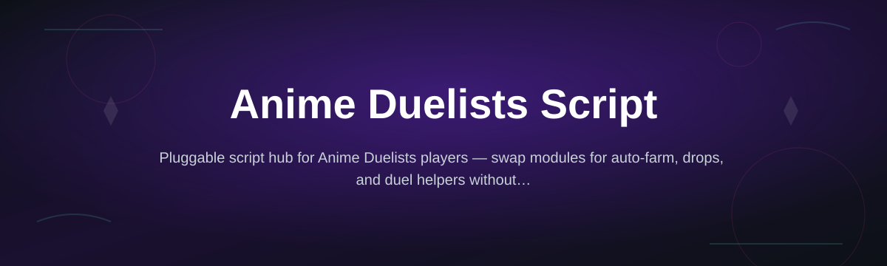
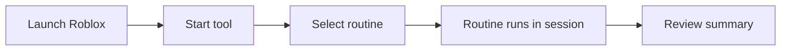

# anime-duelists-script-hub

*A standalone Windows tool for players who want a faster, more consistent Anime Duelists session without manual grinding.*

## What this is

| | Manual play | With anime-duelists-script-hub |
|---|---|---|
| Farming duplicate cards | Repetitive tapping, easy to lose focus | Runs in the background while you do other things |
| Tracking drops | Manual note-taking or guesswork | Consistent, repeatable routine each session |
| Setup time | None, but slow long-term progress | One download, runs as a standalone `.exe` |
| Toolchain | Not applicable | None — no build step, no package manager |

anime-duelists-script-hub is a Windows utility built around Anime Duelists, the Roblox card-battling game. It exists for one reason: the core loop of card farming, duel grinding, and drop tracking rewards repetition, and repetition is exactly what a small standalone tool can handle more consistently than a person tapping through the same menus for an hour.

This repository hosts the project page, changelog, and documentation for the script hub. The tool itself is distributed as a single Windows executable — no source build, no dependency installation, no browser extension. You download it, run it once, and it works against the current version of Anime Duelists as maintained on the linked project page.

  

The button above opens the project page, where the current build is available to download.

## Who it is for

- Players who log long Anime Duelists sessions and want fewer repetitive actions.
- Card collectors trying to complete a set without manually re-running the same duels.
- Players returning after a break who want a quick way to catch up on progress.
- Anyone comparing Anime Duelists tools before choosing one to run on their own PC.
- Players who prefer a standalone `.exe` over browser add-ons or scripts pasted into a console.

## What you can do

| Capability | Description |
|---|---|
| **Automated duel farming** | Runs repeated duel cycles against configured opponents without manual input. |
| **Card drop tracking** | Keeps a running log of cards obtained during a session. |
| **Session scheduling** | Set a start delay or run duration so the tool stops on its own. |
| **Duel target selection** | Choose which opponent type or mode the routine should target. |
| **Progress summary** | View a short end-of-session report of duels run and cards gained. |
| **Low-resource operation** | Designed to run alongside Roblox without heavy CPU or memory use. |
| **Manual override** | Pause or stop the routine instantly and resume normal play. |
| **Update checks** | The tool checks the project page for newer builds when it starts. |

## Getting started

1. Open the project page using the download button above.
2. Download the current Windows build listed there.
3. Run the executable — no installer, no admin setup wizard.
4. Launch Anime Duelists in Roblox, then start the tool and pick a routine.
5. Stop the session anytime; your Roblox account is not modified when the tool is closed.

## Requirements

- Windows 10 or Windows 11 (64-bit).
- Roblox installed and Anime Duelists accessible from your account.
- No Node.js, Python, or build toolchain — the release is a standalone executable.
- A stable internet connection for the initial download and update checks.

## How it works

1. You launch Anime Duelists normally through Roblox.
2. The tool starts and attaches to the running game session.
3. You select a routine — for example, duel farming or drop tracking.
4. The routine repeats the chosen actions and logs results locally.
5. You review the summary or stop the session at any point.

## FAQ

**Is Anime Duelists Script safe to run alongside Roblox?**
The tool operates as a separate Windows process and does not modify Roblox's own files. As with any third-party tool, use an account you're comfortable testing with.

**Does this work on Mac or mobile?**
No. The current build targets Windows 10/11 only. There is no macOS or mobile version at this time.

**Do I need to install anything besides the download?**
No. It ships as a single executable — no package manager, no separate runtime installation.

**Will this get my Roblox account banned?**
Automation tools carry inherent risk with any online game's terms of service. This project cannot guarantee account safety; use your own judgment.

**How often is it updated for new Anime Duelists patches?**
Updates are posted to the project page when compatibility changes are needed. The tool checks for newer builds on startup.

## Troubleshooting

- **Tool won't start:** Confirm you're on Windows 10/11 64-bit and that the download completed fully; re-download if the file size looks wrong.
- **Routine doesn't detect the game:** Make sure Anime Duelists is already open in Roblox before starting the tool.
- **Session stops unexpectedly:** Check for a newer build on the project page — game updates can change how routines run.
- **No visible effect during a session:** Verify the correct routine is selected and that the duel target matches what's available in-game.

## License

Released under the [MIT License](LICENSE). This project is an independent tool related to Anime Duelists and is not affiliated with or endorsed by the game's developers. Use is at your own discretion and risk.

  

